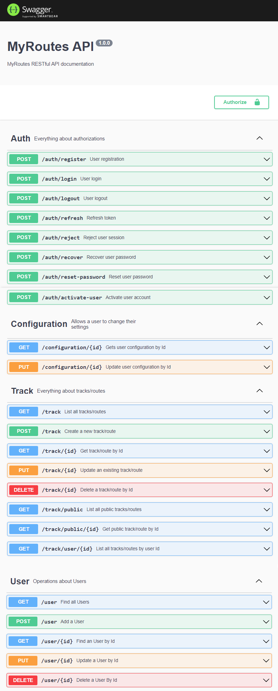

# MyRoutes.Back

## Translations

- [ES Español](./README.es.md)

This is the **API** in **Node.JS** of my **MyRoutes** project.

## Project requirements

**Note**: It works with `Node JS` version **16.20.2**, **20.11.1**, but not with version 18.

## Project setup

### Dependency installation
This install all necesary packages.
```shell
npm install
```

### Environment configuration
We have to configure the environment file. We can see an example in the file ```.env.example```.

```conf
# Environment file example

# API PORT
PORT = 3000

# DATABASE
DB_HOST = <your_db_host>
DB_PORT = <your_db_port>
DB_DATABASE = myroutes
DB_USER = <your_db_user>
DB_PASSWORD = <your_db_password>
DB_CONNECTION_OPTIONS = authSource=admin&readPreference=primary&appname=MongoDB%20Compass&directConnection=true&ssl=false

# MAIL SERVICE
MAILSERVICE_HOST = <your_mail_service_host>
MAILSERVICE_PORT = <your_mail_service_port>
MAILSERVICE_USER = <your_mail_service_user>
MAILSERVICE_PASSWORD = <your_mail_service_password>

# RECOVER PASSWORD
RECOVER_URL = http://localhost:8080/reset-password
RECOVER_TOKEN_DURATION = 5 # minutes

# USER ACCOUNT ACTIVATION
ACTIVATION_URL = http://localhost:8080/activate-user

# TOKEN
SECRET_KEY = <your_secret_key>
TOKEN_DURATION = 5 # minutes
REFRESH_TOKEN_DURATION = 30 # minutes

# LOG
LOG_FORMAT = dev
LOG_DIR = ../logs

# CORS
ORIGIN = *
CREDENTIALS = true
```
For local use in development mode the file will be named as `.env.development.local` and for local use in production mode it will be named as `.env.production.local`.

### Compiles and hot-reloads for development
```shell
npm run dev
```

### API Check
```
http://localhost:3000
```

#### Swagger API documentation screenshot



## Management with Docker

### Create Docker Image

To create the Docker image, the following command has been used:

```
docker build -t sbarquero/myroutes.back:1.1.8 .
docker build -t sbarquero/myroutes.back:latest .
```

### Upload image to repository

To upload the image to Docker, the following command was used:

```
docker push sbarquero/myroutes.back:1.1.8
docker push sbarquero/myroutes.back:latest
```

### Implementation of the backend in Docker containers

By running the following command, the containers needed to get the backend up and running are raised.

The containers created are:
  - `mongodb` - MongoDB server (Port 27018)
  - `mongo-express` - Mongo Express client (Port 8081)
  - `myroutes.back` - MyRoutes backend with NodeJS (Port 3000)

```
docker-compose up
```

### Implementation of the back and front in Docker containers

Visit the project [MyRoutes.Docker in Github](https://github.com/sbarquero/MyRoutes.Docker)
